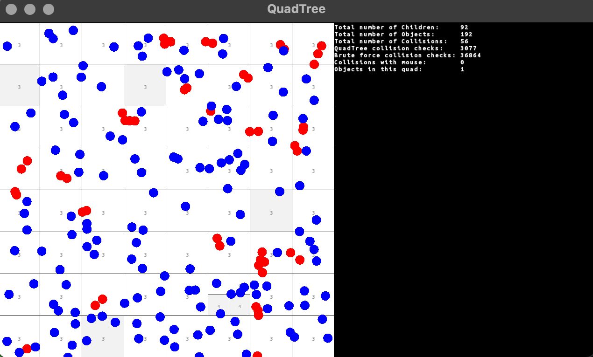

# 2D

**Insert particles by clicking into the GUI!**

## Compiling

> Note: Only tested for MacOS yet

Just use the `make.sh` script to compile the sources and find the binary in *bin/*.

The `make.sh` script executes:

```
g++ -std=c++17 src/Rectangle.cpp src/Particle.cpp src/QuadTree.cpp src/main.cpp -o bin/runner -lsfml-graphics -lsfml-window -lsfml-system
```

### Dependencies

* [SFML](https://www.sfml-dev.org/): simple and fast cross-platform multimedia library


## Content


### CollisionQuadTree   

**CollisionQuadTree** is without any interactions but with collision detection.

#### Keyboard shortcuts

* `F` freeze all objects/ unfreeze all objects
* `M` show center of mass per cell/ hide center of mass
* `C` Clear all objects
* `ESC` exit program

#### Sample output

  
