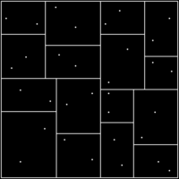

# MPI_NBody

## Current status

Currently parallelized:

* calculation of gravitational forces 
* updating particle positions, velocities, accelerations

## To be done

### Parallelization

To be parallelized:

* Initial particle distribution
* Tree construction
* ...

### Other improvements

* load balancing
* ...

## Barnes-Hut algorithm in a nutshell

The Barnes-Hut algorithm is a hierarchical algorithm using the *divide and conquer* approach, where the system is spatially decomposed into a hierarchical cluster forming a tree. Each node describes the mass and volume of a cluster in the system.

1. First phase of the Barnes-Hut algorithm is constructing a hierarchical octtree (for 3D space) through recursive subdivision of the root cell into eight (cubic) subcells (of equal size) and then progressing recursively on each of the subcells untial at most one particle is in one subcell. Therefore, leaves represent cells containing (at most) one particle. Whereas parent nodes contain the total mass and center of mass (COM) of the corresponding subtree below. 
2. The second phase embraces computnig the forces experiened by each particles by traversing the tree, whereas interactions between distant particles is approximated as single combined force between particle and cluster (many far particles) as a whole, using the total mass and COM.

> The algorithm for force calculation on each particle proceeds by starting at the root cell. If the distance between the particle and the center of mass of the cluster is D, and the length of the cell is l, the interaction between the particle and the cell (cluster) as a whole is calculated if l/D < θ, where θ is a constant accuracy parameter, typically ≤ 1.0. If not, the current cell is resolved into its eight subcells, and each of them is examined recursively.

Once the above steps are completed the N-body algorithm proceeds by computing the new celocities and positions, discarding the tree. A new tree is generated for each iteration.

The construction of the tree for N particles is of the order O(NlogN) and the computation of all forces is of the order of O(NlogN) resulting in a **overall running time complexity of O(NlogN)** in contrast to O(N²) for the Brute-force method.

## Parallelizing the N-Body Problem (using MPI)

### Simple and intuitive approach

An intuitive and simple approach is to partition the problem into P groups, whereas P is the number of processors. Each group or processor is responsible for **N/P** particles.  
Each processor is responsible to **calculate the forces** and **updating the particles** (position, velocity, ...) for the assigned particles.  
At the end of each iteration the **processors exchange the relevant information** of the updated particles. The tree is generated on each processor.

#### Resulting problems/inefficiencies

* Tree construction is not parallel, since tree is generated on each processor
* having a uneven distribution of particles in the system leads to a unbalanced tree, and consequently to a imbalance in the load distribution of the processors (having some of the processors performing more calculations than others)

### Further optimizations

#### Decompose in dependence of particle distribution

Use the method of orthogonal recursive bisection (as described above) by recursively decompose the system into sub-volumes in such a way that equal number of particles lie on either side of the division. The decomposition continues for as many levels as necessary resulting in a **well balanced tree**.  
Each of the processors is then assigned to one (or more) subvolume(s), handling (almost) the same number of particles.

#### Update tree instead of discarding and regenerating tree

For small time steps particles are moving very small distances for each iteration. By not discarding the entire tree in every iteration, but **regenerating** those **parts of the tree** whose corresponding particles have moved outside the cell, a significant computation time can be saved (for large particle numbers).

#### Partial tree per processor

Parallelizing the tree generation, such that each processor **generates a partial tree** containing the particles belonging to it, and exchanging the partial trees with the other processors, thus, each processor have a complete tree.

