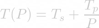
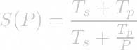
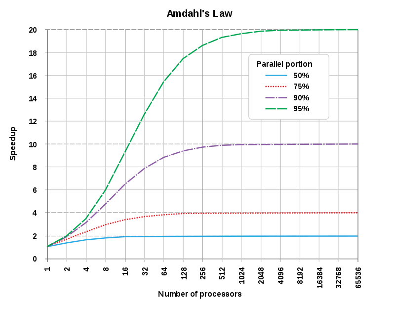

# MPI_CPP

**Exploring Message Passing Interface (MPI) usage with (modern) C++.**

The [Message Passing Interface (MPI)](https://de.wikipedia.org/wiki/Message_Passing_Interface) provides bindings for the C and Fortran, since the C++ bindings are removed. Threfore programmers are forced to use either the C API or rely on third-party libraries/implementations.

A communicator defines a group of processes that have the ability to communicate with another in dependence of their ranks. Communication is based on sending and receiving operations among processes. If one sender and receiver is involved, this refers to point-to-point communication. If a process need to communicate with everyone else collective communication involves all processes.
First the MPI header files need to be included ```#include <mpi.h>``` and the MPI environment must be initialized with

```cpp
MPI_Init(int* argc, char*** argv)
```

constructing all of MPI’s global and internal variables. After that

```cpp
MPI_Comm_size(MPI_Comm communicator, int* size)
```

returns the size of a communicator and

```cpp
MPI_Comm_rank(MPI_Comm communicator, int* rank)
```

returns the rank of a process in a communicator. The ranks of the processes are (primarily) used for identification purposes when sending and receiving messages.
Using

```cpp
MPI_Get_processor_name(char* name, int* name_length)
```

gives the actual name of the processor on which the process is executing. The final call is

```cpp
MPI_Finalize()
```

used to clean up the MPI environment and no more MPI calls can be done afterwards.

## Compiling

using 

```bash
mpic++ mpi_file.cpp -o mpi_file
```
for compiling C++ files using MPI and 

```bash
mpirun -np 2 mpi_runner
```
for running the script.


Related compilers/scripts:

* ```mpic++```
* ```mpicc```
* ```mpichversion```
* ```mpicxx```
* ```mpiexec```
* ```mpiexec.hydra```
* ```mpif77```
* ```mpif90```
* ```mpifort```
* ```mpioutil```
* ```mpirun```
* ```mpivars```

## TODO

* explore implementations
* explore best practice with C++
* learn MPI
* ...

### Links

* [CSP Wikipedia](https://en.wikipedia.org/wiki/Communicating_sequential_processes)
* [CSP Hoare book](http://www.usingcsp.com/cspbook.pdf)
* [MPI standard](https://www.mpi-forum.org/docs/)
* [MPI Hands-On - C++](http://education.molssi.org/parallel-programming/04-distributed-examples/index.html)
* [MPI interface](https://www.mpich.org/static/docs/v3.2/) --- from the MPICH team
* [MPI tutorial](https://computing.llnl.gov/tutorials/mpi/) from LLNL --- excellent, thorough, with good links
* [MPI tutorial](http://www.archer.ac.uk/training/course-material/2018/07/mpi-epcc/notes/MPP-notes.pdf) --- 2 days
* [MPI tutorial](https://htor.inf.ethz.ch/teaching/mpi_tutorials/ppopp13/2013-02-24-ppopp-mpi-basic.pdf) --- MPI for dummies
* [MPI lectures](http://wgropp.cs.illinois.edu/courses/cs598-s16) from Gropp at UIUC --- excellent and very detailed
* [Intel MPI](https://software.intel.com/en-us/intel-mpi-library/documentation) documentation
* [Intel C++](https://software.intel.com/en-us/cpp-compiler-18.0-developer-guide-and-reference) compiler documentation
* [GNU C/C++](https://gcc.gnu.org/onlinedocs/gcc-9.1.0/gcc) compiler documentation
* [MPI books](http://wgropp.cs.illinois.edu/usingmpiweb/) by Gropp good for intro and reference


## Open MPI

* [Open MPI v4 documentation](https://www.open-mpi.org/doc/v4.0/)
* [How to MPI](https://hpc-wiki.info/hpc/How_to_Use_MPI)

## Implementations

In order to use MPI the C bindings can be used, either directly or by wrapping it into a C++ class.

### Boost.MPI

* [Documentation Boost.MPI](https://www.boost.org/doc/libs/1_64_0/doc/html/mpi.html)
* [Implementation (GitHub)](https://github.com/boostorg/mpi)


### OOMPI

* [Publication: Object Oriented MPI (OOMPI): A C++ Class Library for MPI Version 1.0.3](https://www.researchgate.net/publication/2801121_Object_Oriented_MPI_OOMPI_A_C_Class_Library_for_MPI_Version_103)


### MPP

* [Publication: A lightweight C Interface to MPI](https://www.researchgate.net/publication/216836687_A_Lightweight_C_Interface_to_MPI)
* [Implementation (GitHub)](https://github.com/motonacciu/mpp)


Further, having a look at:

* [Caffe-MPI](https://github.com/Caffe-MPI/Caffe-MPI.github.io)
* [MPIO](https://github.com/frsyuki/mpio)
* [TorchMPI](https://github.com/facebookarchive/TorchMPI)
* [MPIPlatform](https://github.com/slowbull/MPIPlatform)
* [TIMPI](https://github.com/libMesh/TIMPI)

## Examples

* [MPI and OpenMP examples](https://github.com/kcherenkov/Parallel-Programming-Labs)
* [Boost.MPI examples](https://github.com/boostorg/mpi/tree/develop/example)


# MPI introduction

## Why MPI?

### Motivation

* Performance
* Memory limitations
* Price-performance
* Correctness
* ...

The only cost-effective path to massive performance is connecting multiple computers via a high-performance network. More computers (each containing mulitple CPUs (cores), GPUs, other accelerators) mean:

* more compute power
* more memory
* more memory bandwidth
* more disk space 
* ...

### Problem

The cluster of computers need to collaborate in the solution of a single science problem. 
The **major challange** is that the processes do not share any memory (distributed across cluster) and eventually not even a file system, which is a classic problem in **concurrent systems/programming**.
Using the **communicating sequential processes (CSP) model** provides a solution.

The essential idea of **CSP** is sending messages to each other, so that everyone has the data needed to solve the assigned (partial) problem.

This approachis different to **shared-memory** programs, but **message-passing** programs are intrinsically safer and sometimes easier to write, since within a shared-memory program any process/thread can modify any shared data at any time.

Finally, even within a shared-memory computer a message-passing program can sometimes run faster than a shared-memory program, since it is expensive (in time and energy) to share data between processors and it is hard to design a shared-memory program that minimizes the amount of data being touched by multiple processors.

The [Message Passing Interface (MPI)](https://www.mpi-forum.org/docs/) is now the defacto standard for message passing in high-performance computing, with multiple implementations.

The objective of this brief tutorial is to introduce key elements of MPI and its practical use within the molecular sciences.


## Hello world

### Writing hello world

A sequential version 

```cpp
    #include <iostream>
    int main() {
        std::cout << "Hello World" << std::endl;
        return 0;
    }
```
Build: `g++ -o hello hello.cc` (GNU).

### Required elements of all MPI programs

* Include `mpi.h` --- older versions of some MPI implementations required it be the first header
* Initialize MPI --- by calling 
	* [`MPI_Init`](https://www.mpich.org/static/docs/v3.2/www3/MPI_Init.html), or 
	* [`MPI_Init_thread`](https://www.mpich.org/static/docs/v3.2/www3/MPI_Init_thread.html). 

Usually the first line of the main program will be similar to the following

```cpp
    MPI_Init(&argc,&argv);
```

or this if errors are handled

```cpp
    if (MPI_Init(&argc,&argv) != MPI_SUCCESS) MPI_Abort(MPI_COMM_WORLD, 1);
```

* Finalize MPI --- by calling [`MPI_Finalize`](https://www.mpich.org/static/docs/v3.2/www3/MPI_Finalize.html) usually the penultimate line of the main program will be

```cpp
    MPI_Finalize();
```

* Initializing MPI gives access to the default communicator (`MPI_COMM_WORLD`)
    * An intra communicator encapsulates all information and resources needed for a group of processes to communicate with each other.  For simple applications it will always be `MPI_COMM_WORLD` but for more complex applications the communicator should be passed into all routines to enable reuse and interoperability.
    * The number of processes can be obtained by calling [`MPI_Comm_size`](https://www.mpich.org/static/docs/v3.2/www3/MPI_Comm_size.html)
    * The rank (`0,1,2,...`) of the current process can be obtained by calling [`MPI_Comm_rank`](https://www.mpich.org/static/docs/v3.2/www3/MPI_Comm_rank.html)
* Note how MPI wants access to the command line arguments. `NULL` can be used instead of `argv` and `argc` but passing arguments to MPI is very useful.


### Error detection and exit

* MPI functions return `MPI_SUCCESS` on success or an error code on failure depending on how errors are handled.
* By default errors abort (i.e., the error handler is `MPI_ERRORS_ARE_FATAL`).  To make MPI return errors to handle, call [`MPI_Errhandler_set`](https://www.mpich.org/static/docs/v3.2/www3/MPI_Errhandler_set.html)`(MPI_COMM_WORLD, MPI_ERRORS_RETURN)`.
* To abort execution don't just `exit` or `return` because there's lots of clean up that needs to be done when running in parallel --- a poorly managed error can easily waste computer time.  Call `MPI_Abort` to exit with an error code.

Consequently, *Hello World* looks like:

```cpp
#include <mpi.h>
#include <iostream>
    
int main(int argc, char** argv) {
    MPI_Init(&argc,&argv);
    
    int nproc, rank;
    MPI_Comm_size(MPI_COMM_WORLD, &nproc);
    MPI_Comm_rank(MPI_COMM_WORLD, &rank);
    
    std::cout << "Hello from process " << rank << " of " << nproc << std::endl;
    
    MPI_Finalize();
    return 0;
}
```

### Compiling MPI programs

* MPI provides wrappers for compiling and linking programs because there's a lot of machine specific stuff that must be done.
* GNU stack: `mpicxx`, `mpicc`, `mpifort`, etc. (see [here](https://software.intel.com/en-us/mpi-developer-reference-linux-compiler-commands))
* Intel C++ compiler and MPI library: `mpiicpc` (`mpiifort` for the Intel FORTRAN, `mpiicc` for Intel C).

### Running MPI programs

The program can be run sequentially just like any other program.

To run it in parallel, use the `mpirun` command (this is system dependent and a common variant is `mpiexec`) since again there's lots of machine dependent stuff that needs doing.  
Next choose amount of processes:

~~~
mpirun -np 4 ./mpihello1
~~~

Giving an output like: 

~~~
Hello from process 1 of 4
Hello from process 0 of 4
Hello from process 3 of 4
Hello from process 2 of 4
~~~

or (more likely):

~~~
Hello from process Hello from process 1 of 4
Hello from process 2 of 4
3 of 4
Hello from process 0 of 4
~~~

On most clusters a batch system is used to

* time share the computers in the cluster
* queue jobs according to priority, resource needs, etc.


## Sending and receiving messages --- point to point communication

### Essential elements

1. Process rank, message tag, MPI data type, communicator size
2. Blocking communication
3. One minimal set of six operations
3. Buffering and safe communication
4. Non-blocking communication
5. Implied weak synchronization
6. Other communication modes (synchronous send, buffered send)

A process is identified by its rank --- an integer `0,1,..,P-1` where `P` is the number of processes in the communicator (`P` is the size of the communicator).

Every message has a `tag` (integer) that can be used to uniquely identify the message.  This implements the CSP concept of message type --- MPI uses the term `tag` in order to distinguish from the datatype being sent (byte, integer, double, etc.).

In a conversation between a pair of processes, messages of the same `tag` are received in the order sent.

But messages from multiple processes can be interleaved with each other.


### Blocking communication

* When a blocking send function ([`MPI_Send`](https://www.mpich.org/static/docs/v3.2/www3/MPI_Send.html)) completes the buffer can immediately be reused without affecting the sent message.  Note that the receiving process may not necessarily have yet received the message.
* When a blocking recv function ([`MPI_Send`](https://www.mpich.org/static/docs/v3.2/www3/MPI_Recv.html)) completes the received message is fully available in the buffer.

```cpp
int MPI_Send(const void *buf, int count, MPI_Datatype datatype, int dest, int tag,  MPI_Comm comm);
```

* `buf` --- pointer to the start of the buffer being sent
* `count` --- number of elements to send
* `datatype` --- MPI data type of each element
* `dest` --- rank of destination process
* `tag`  --- message tag
* `comm` --- the communicator to use

```cpp
int MPI_Recv(void *buf, int count, MPI_Datatype datatype, int source, int tag, MPI_Comm comm, MPI_Status *status);
```

* `buf` --- pointer to the start of the buffer to receive the message
* `count` --- maximum number of elements the buffer can hold
* `datatype` --- MPI data type of each element
* `source` --- rank of source process ---  `MPI_ANY_SOURCE` matches any process
* `tag`  --- message tag (integer `>= 0`) --- `MPI_ANY_TAG` matches any tag
* `comm` --- the communicator to use
* `status` --- pointer to the structure in which to store status

The actual source and tag of the received message can be accessed directly from the status.  Call [`MPI_Get_count`](https://www.mpich.org/static/docs/v3.2/www3/MPI_Get_count.html) to get the count.

```cpp
status.MPI_TAG;
status.MPI_SOURCE;
MPI_Get_count( &status, datatype, &count );
```

There's data types for everything, and new ones can be defined including non-contiguous data structures:

|**MPI data type**  |**C data type**     |
|:------------------|:-------------------|
|`MPI_BYTE`           |8 binary digits     |
|`MPI_CHAR`           |char                |
|`MPI_UNSIGNED_CHAR`  |unsigned char       |
|`MPI_SHORT`          |signed short int	 |	 
|`MPI_UNSIGNED_SHORT` |unsigned short int	 |	 
|`MPI_INT`            |signed int          |
|`MPI_UNSIGNED`       |unsigned int	 |	 
|`MPI_LONG`           |signed long int	 |	 
|`MPI_UNSIGNED_LONG`  |unsigned long int |	 
|`MPI_FLOAT`          |float               |
|`MPI_DOUBLE`         |double              |
| ...              |                    |
|`MPI_PACKED`	    |define new ones using|
|                   |[`MPI_Pack`](https://www.mpich.org/static/docs/v3.2/www3/MPI_Pack.html) |
| | [`MPI_Unpack`](https://www.mpich.org/static/docs/v3.2/www3/MPI_Pack.html)|
### One minimal set of six operations

~~~
MPI_Init
MPI_Finalize
MPI_Comm_size
MPI_Comm_rank
MPI_Send
MPI_Recv
~~~

A timer is also useful --- [`MPI_Wtime`](https://www.mpich.org/static/docs/v3.2/www3/MPI_Wtime.html) returns a high precision wall clock (elapsed) time.  Note that clocks on each process are **not** synchronized.


### Non-blocking (asynchronous) communication

* When a non-blocking send function ([`MPI_Isend`](https://www.mpich.org/static/docs/v3.2/www3/MPI_Isend.html)) completes, the user must not modify the send buffer until the request is known to have completed (e.g., using ([`MPI_Test`](https://www.mpich.org/static/docs/v3.2/www3/MPI_Test.html)) or [`MPI_Wait`](https://www.mpich.org/static/docs/v3.2/www3/MPI_Wait.html)).

* When a non-blocking recv function ([`MPI_Irecv`](https://www.mpich.org/static/docs/v3.2/www3/MPI_Irecv.html)) completes, any message data is not completely available in the buffer until the request is known to have completed.

```cpp
int MPI_Isend(const void *buf, int count, MPI_Datatype datatype, int dest, int tag,  MPI_Comm comm, MPI_Request *request);
int MPI_Irecv(void *buf, int count, MPI_Datatype datatype, int source,  int tag, MPI_Comm comm, MPI_Request *request);
```

* `request` --- a pointer to structure that will hold the information and status for the request

```cpp
int MPI_Test(MPI_Request *request, int *flag, MPI_Status *status);
int MPI_Wait(MPI_Request *request, MPI_Status *status);
int MPI_Cancel(MPI_Request *request);
```

* `request` --- a pointer to the request being tested/waited-upon/cancelled
* `flag` --- a pointer to an int that will be non-zero (true) if the operation has completed
* `status` --- a pointer to the structure in which status will be stored if the operation has completed
* See `MPI_Waitall`, `MPI_Waitany` and `MPI_Waitsome` for waiting on multiple requests


### Other P2P communication modes

*  **Buffered send** --- provide sender-side buffering to ensure a send always completes and to make memory-management more explicit
*  **Synchronous send** --- completes on the sender-side when the receive has also completed
*  **Ready send** --- if you know a matching receive has already been posted this enables optimizations, and this style of programming is explicitly safe from memory/buffer issues
*  **One-sided operations** --- remote memory access (RMA)


## Global or collective operations

### Essential elements

1. Broadcast
2. Reduction
3. Implied global synchronization
4. Other global operations

In constrast to point-to-point operations that involve just two processes, global operations move data between **all** processes asscociated with a communicator with an implied **synchronization** between them.  All processes within a communicator are required to invoke the operation --- hence the alternative name **collective operations**.

This approach does not necessarily scale to the very largest supercomputers, but can suffice for many needs.

### Broadcast

([`MPI_Bcast`](https://www.mpich.org/static/docs/v3.2/www3/MPI_Bcast.html)) broadcasts a buffer of data from process rank `root` to all other processes. Once the operation is complete within a process its buffer contains the same data as that of process `root`.

```cpp
int MPI_Bcast (void *buffer, int count, MPI_Datatype datatype, int root,  MPI_Comm comm)
```

* `root` --- the process that is broadcasting the data --- this **must** be the same in all processes


### Reduction

To combines values from all processes with a reduction operation either to just process `root` (([`MPI_Reduce`](https://www.mpich.org/static/docs/v3.2/www3/MPI_Reduce.html))) or distributing the result back to all processes (([`MPI_Allreduce`](https://www.mpich.org/static/docs/v3.2/www3/MPI_Allreduce.html))).

```cpp
int MPI_Reduce (const void *sendbuf, void *recvbuf, int count, MPI_Datatype datatype, MPI_Op op, int root, MPI_Comm comm);

int MPI_Allreduce (const void *sendbuf, void *recvbuf, int count, MPI_Datatype datatype, MPI_Op op, MPI_Comm comm );
```

* `sendbuf` --- a pointer to the buffer that contains the local data to be reduced
* `recvbuf` --- a pointer to the buffer that will hold the result

There are many pre-defined reduction operations and new ones can be defined 

|**Operation** | Description | Datatype|
|:-------------|:------------|:--------|
|`MPI_MAX`       |maximum      |integer, float|
|`MPI_MIN`       |minimum      |integer, float|
|`MPI_SUM`       |sum          |integer, float|
|`MPI_PROD`      |product      |integer, float|
|`MPI_LAND`      |logical AND  |integer|
|`MPI_BAND`      |bit-wise AND |integer, MPI_BYTE|
|`MPI_LOR`       |logical OR   |integer|
|`MPI_BOR`       |bit-wise OR  |integer, MPI_BYTE|
|`MPI_LXOR`      |logical XOR  |integer|
|`MPI_BXOR`      |bit-wise XOR |integer, MPI_BYTE|
|`MPI_MAXLOC`    |max value and location|float|
|`MPI_MINLOC`    |min value and location|float|


### Other global operations

There are many other global operations, like

* barrier
* gather
* scatter
* parallel prefix
* etc.

There are also asynchronous variants,which are interesting because they may permit overlap of multiple global operations, or overlap of work and communication, or reduce the impact of load imbalance.


### Another minimal set of six operations

~~~
MPI_Init
MPI_Finalize
MPI_Comm_size
MPI_Comm_rank
MPI_Bcast
MPI_Reduce
~~~

Or a total of eight, including 
~~~
    MPI_Send
    MPI_Recv
~~~

## Performance reasoning

Essential concepts to reason about the performance the message-passing application

* Amdahl's law, speed up and efficiency
* Weak and strong scaling
* Load balance, data balance, hot spots, synchronizations
* Latency and bandwidth of communication


### Amdahl's law

[Amdahl's law](https://en.wikipedia.org/wiki/Amdahl%27s_law) is a formula which gives the theoretical speedup in latency of the execution of a task at fixed workload that can be expected of a system whose resources are improved.

Dividing the execution time into a sequential component (*Ts*) and perfectly parallel component (*Tp*) the execution time on *P* processes is then



Speedup is the ratio of sequential to parallel execution time (whereas efficiency is the ratio of the ideal speedup, *P*, and the actual speedup)





For these reasons the concepts of strong and weak scaling were introduced.

* **Strong scaling:** An application shows good strong scaling if for a fixed problem size it shows a near ideal (linear in *P*) speedup as you add more processes, which is hardly achievable.

* **Weak scaling:** An application shows good weak scaling if its execution time remains constant as the amount of work is increased proportional to the number of processors.


### Load, data balance and hot spots

It can be very hard to distribute work uniformly (**load balancing**) across all of the processes. For some applications, work is entirely driven by the data but this is not always the case. A process that has too much work is sometimes referred to as a **hot spot**.

Data distribution can also be a challenge, since the finite memory of each node is one constraint and another is that all of the data needed by a task must be brought together for it to be executed. 

A **non-uniform data distribution** can also lead to communication hot spots (processors that must send/recv a lot of data) or hot links (wires in the network that are heavily used to transmit data).  This last point highlights the role of network topology --- the communication pattern of the application is mapped onto the wiring pattern (toplogy) of the network.  A communication intensive application may be sensitive to this mapping, and MPI provides some assistance for this (e.g. [here](http://wgropp.cs.illinois.edu/courses/cs598-s16/lectures/lecture28.pdf)).

The performance impact of poor load balance will become apparent at synchronization points (e.g., blocking global communications) where all processes must wait for the slowest one to catch up.


### Latency and bandwidth

For point-to-point communication, the central concepts are 

* **latency** (*L*): the time in seconds for a zero-length message
* **bandwidth** (*B*): speed of data transfer in bytes/second 

Therefore the time to send a message of *N* bytes is


For typical modern computers:

* *L*=1-10us 
* *B*=1-100Gbytes/s

It is hard to accurately measure the latency since on modern hardware the actual cost can depend upon what else is going on in the system and upon your communication pattern.  The bandwidth is a bit easier to measure by sending very large messages, but it can still depend on communication pattern and destination.

An important and easy to remember value is *N1/2*, which is the message length necessary to obtain 50% of peak bandwidth (i.e., *T(N)=2N/B*)


Bisection bandwidth is another important concept especially if you are doing a lot of communication all at once.  The network connecting the computers (nodes) in your cluster probably does not directly connect all nodes with every other node --- for anything except a small cluster this would involve too many wires (*O(P^2)* wires, *P*=number of nodes).  Instead, networks use simpler topologies with just *O(P)* wires --- e.g., mesh, n-dimension torous, tree, fat tree, etc.  Imagine dividing this network in two halves so as to give the worst possible bandwidth connecting the halves, which you can derive by counting the number of wires that you cut. This is the bisection bandwidth.  If your application is doing a lot of communication that is not local but is uniform and random, the effective bandwidth is the bisection bandwidth divided by the number of processes.  This can be much smaller than the bandwidth obtained by a single message on a quiet machine.  For instance, in a square mesh of P processes, the bisection bandwidth is *O(sqrt(P))* and if all proceses are trying to communicate globally the average available bandwidth is *O(1/sqrt(P))*, which is clearly not scalable.

Thus, the communication intensity and the communication pattern of the application are both important. Spreading communication over a larger period of time is a possible optimization. Another is trying to communicate only to processes that are close in the sense of distance (wires traversed) on the actual network.

For **global communication**, the details are more complicated because a broadcast or reduction is executed on an MPI-implementation-specific tree of processes that is mapped to the underlying network topology.  However, for long messages an optimized implementation should be able to deliver similar bandwidth to that of the point-to-point communication, with a latency that grows roughly logarithmically with the number of MPI processes.


## Additional concepts and MPI features

* Process groups
* Inter communicators
* Toplogies
* Implementation attributes
* I/O
* ...