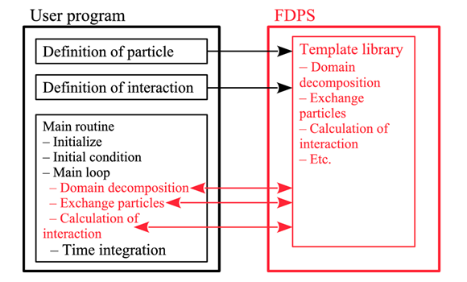
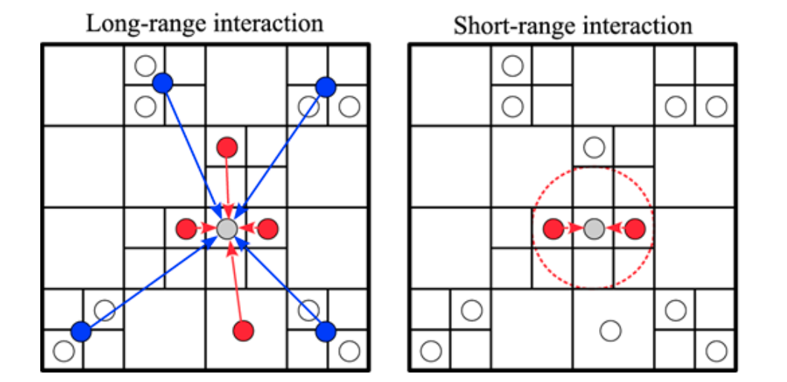
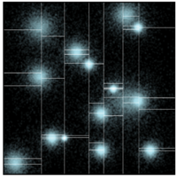

# FDPS

FDPS is a general-purpose, high-performance library for particle simulations.

We present the basic idea, implementation, measured performance, and performance model of FDPS (Framework for Developing Particle Simulators). FDPS is an application-development framework which helps researchers to develop simulation programs using particle methods for large-scale distributed-memory parallel supercomputers. A particle-based simulation program for distributed-memory parallel computers needs to perform domain decomposition, exchange of particles which are not in the domain of each computing node, and gathering of the particle information in other nodes which are necessary for interaction calculation. Also, even if distributed-memory parallel computers are not used, in order to reduce the amount of computation, algorithms such as the Barnes–Hut tree algorithm or the Fast Multipole Method should be used in the case of long-range interactions. For short-range interactions, some methods to limit the calculation to neighbor particles are required. FDPS provides all of these functions which are necessary for efficient parallel execution of particle-based simulations as “templates,” which are independent of the actual data structure of particles and the functional form of the particle–particle interaction.

## Links

* [GitHub: FDPS](https://github.com/FDPS/FDPS)
* [FDPS article/summary](https://academic.oup.com/pasj/article/68/4/54/2223184)

## How it works

In a particle-based simulation code that uses the space decomposition on distributed-memory parallel computers, the calculation proceeds in the following steps.

* The computational domain is divided into subdomains, and each subdomain is assigned to one MPI process. This step is usually called “domain decomposition.” Here, minimization of inter-process communication and a good load balance among processes should be achieved.
* Particles are exchanged among processes, so that each process owns particles in its subdomain. In this paper we call this step “particle exchange.”
* Each process collects the information necessary to calculate the interactions on its particles. We call this step “interaction-information exchange.”
* Each process calculates interactions between particles in its subdomain. We call this step “interaction calculation.”
* The data for each particle are updated using the calculated interactions. This part is done without inter-process communication.

FDPS performs the neighbor search if the interaction is of a short-range nature. If the long-range interaction is used, currently FDPS uses the **Barnes–Hut tree** algorithm. In other words, within FDPS, the distinction between the long-range and short-range interactions is not a physical one but an operational one.

## Implementation

* FDPS uses the **multisection method** with the so-called **sampling method** (as a generalization of **O**rthogonal **R**ecursive **B**isection)

### Domain decomposition

* Each process samples particles randomly from its own particles. In order to achieve an optimal load balance, the sampling rate of particles is changed so that it is proportional to the CPU time per particle spent on that process (Ishiyama et al. 2009). FDPS provides several options including this optimal balance.
* Each process exchanges the sample particles according to the current domain boundary in the x-direction with the process with the same y and z indices, so that they have sample particles in the current domain decomposition in the x-direction.
* Each process with index (i, y, z) sends the sample particles to the process with index (i, 0, 0), in other words, the root processes in each y–z plane collects subsamples.
* Each root process sorts the sample particles in the x-direction. Now, the sample particles are sorted globally in the x-direction.
* Each root process sends the number of the sample particles to the other root processes and determines the global rank of the sample particles.
* The x coordinate of new domains is determined by dividing all sample particles into nx subsets with equal numbers of sample particles.
* Each root process exchanges sample particles with other root processes, so that they have the sample particles in new domain in the x-direction.
* Each root process determines the y and z coordinates of new domains.
* Each root process broadcasts the geometries of new domains to all other processes.

### Interaction

For both, short and long range forces the Barnes-Hut octree structure is used. Each process sends the data required by other nodes.

