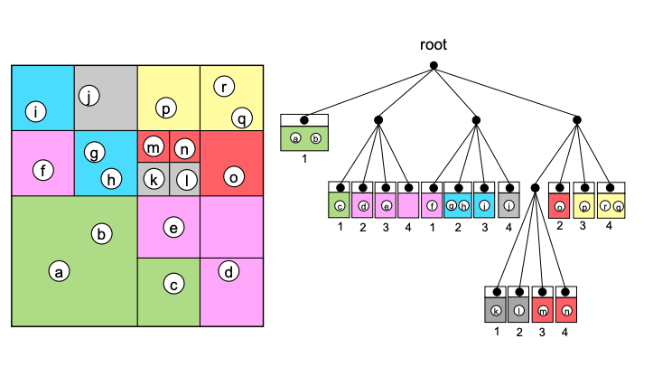
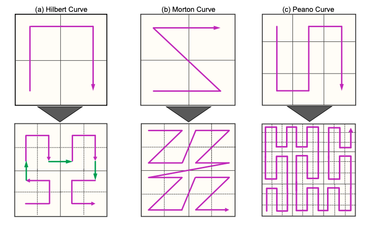

# Effective Dynamic Load Balance using Space-Filling Curves for Large-Scale SPH Simulations on GPU-rich Supercomputers

## Abstract

In this study, we develop a novel code of large-scale SPH
simulations on a multi-GPU platform by using the domain
decomposition technique. The computational load of each
decomposed domain is dynamically balanced by applying
domain re-decomposition, which maintains the same number
of particles in each decomposed domain, by using **two different
techniques of dynamic load balance:**

* the slice-grid method 
* the hierarchical domain decomposition method using the spacefilling curve.

## Links

* [Effective Dynamic Load Balance using Space-Filling Curves for Large-Scale SPH Simulations on GPU-rich Supercomputers](https://www.researchgate.net/publication/313451500_Effective_Dynamic_Load_Balance_using_Space-Filling_Curves_for_Large-Scale_SPH_Simulations_on_GPU-rich_Supercomputers/link/5ce4ecf7a6fdccc9ddc4bf70/download) by Satori Tsuzuki and Takayuki Aoki 

## Hierarchical domain decomposition method 

The computational domain becomes recursively
divided into sub-leafs by the tree, and the distal leafs of
the constructed tree are connected by using a space-filling
curve so that each bundle of leafs has the same number of
particles.

The pattern of connection differs depending
on the types of space-filling curves, and it strongly affects
the neighboring connectivity of each sub-domain.

A constraint
is imposed on h, the influence radius of SPH, making it
smaller than $L_{cell}$ because **one layer of cells around each
sub-domain is exchanged among neighboring sub-domain** in
our multi-GPU implementation.

$C_{halo} = \frac{L_{cell}}{h} = \frac{L}{S^d \times h} \geq 1.0$
