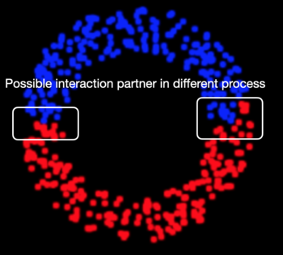

# Parallel Fixed Radius NN

The overall code/project is about 

* **SPH**: short range forces in dependence of smoothing length 
* including **self-gravity**: long range force over whole domain
	* implemented via the **Barnes-Hut tree method** (as approximative method)

Therefore: **utilize the Barnes-Hut tree or rather Octree structure for fixed-radius near(est) neighbor search!**

## Serial Implementation

* **Search for all particles the interaction partners** (and count them for the moment)

```cpp
void TreeNode::nearNeighbourList(float radius) {
    ParticleList particleList;
    getParticleList(particleList);

    IntList interactionPartners;

    for (int i=0; i<particleList.size(); i++) {
         ParticleList interactionPartner;
         findInteractionPartners(particleList[i], interactionPartner, radius);
         interactionPartners.push_back((int)interactionPartner.size());
    }

    for (int i=0; i<interactionPartners.size(); i++) {
        Logger(INFO) << "#interaction partners: " << interactionPartners[i];
    }
}
```

* **Traverse tree for finding interaction partners**
	* stop traversing/searching if
		* son is `NULL` (end of tree/leaf is reached)
		* domain box is not overlapping with search ball of the (current) particle
	* add particle if
		* distance to particle is within the radius
		* the whole box is within the search ball (add all particles within this box) 

```cpp
void TreeNode::findInteractionPartners(Particle &particle, ParticleList &particleList, float radius) {
    if (isLeaf() && !isDomainList()) {
        if (particle.withinRadius(p, radius)) {
            particleList.push_back(p);
        }
    }
    else {
        for (int i=0; i<POWDIM; i++) {
            if (son[i] != NULL) {
                if (son[i]->box.completelyWithinRadius(particle.x, radius)) {
                    son[i]->getParticleList(particleList);
                }
                else {
                    if (son[i]->box.withinRadius(particle.x, radius)) {
                        son[i]->findInteractionPartners(particle, particleList, radius);
                    }
                }
            }
        }
    }
}
```

* check if domain box is completely within the radius/search ball (of a particle)

```cpp
bool Domain::completelyWithinRadius(Vector3<float> &vec, float radius) {
    VectorList corners;
    getCorners(corners);

    for (int i=0; i<corners.size(); i++) {
        if (!vec.withinRadius(corners[i], radius)) {
            return false;
        }
    }
    return true;
}
```
* check if domain box intersects with the radius/search ball (of a particle)

```cpp
bool Domain::withinRadius(Vector3<float> &vec, float radius) {
    float distance = smallestDistance(vec);
    if (distance < radius) {
        return true;
    }
    else {
        return false;
    }
}
```

## Parallelization

### Problems

* Possible neighbors or rather interaction partners could be in another process
	* therefore not accessible
* **How to determine if and which particles from other processes needed for SPH/short-range forces?**	

Simulation with 2 processes:



### (Possible) Solutions

#### Exchange particles

**Utilize the common coarse tree to determine particles to be exchanged for short range forces**

for all particles $p_i$ at $\vec{x}_i$ (with $0 \leq i < N$, whereas $N$ is the amount of particles)
and the smoothing length $h_i$:

* check whether $S(\vec{x}_i, h_i)$ is completely within the corresponding subdomain (using the common coarse tree)
	* **yes:** continue as in the serial case
	* **no:** request particle/information from overlapping processes/subdomains
		* process information (e.g. insert in local tree)
		* continue as in the serial case
		* (get rid of *additional* particles)

#### Halo

**Add a redundant halo to each subdomain for short range forces**

for all particles $p_i$ at $\vec{x}_i$ (with $0 \leq i < N$, whereas $N$ is the amount of particles)
and the smoothing length $h_i$ within a subdomain/process:

* determine $max(h_i)$
* adapt range (of particle keys), so that one layer of cells around each
subdomain is exchanged among neighboring subdomains, in order to have all information 
within the local subdomain/tree

> May adapt NBody algorithm to take this into account

## Parallel implementation

### Find particles with possibly missing information

```cpp
void SubDomain::nearNeighbourList(tFloat radius) {
    ParticleList particleList;
    root.getParticleList(particleList);

    bool interactionPartner;

    int counter = 0;
    for (int i=0; i<particleList.size(); i++) {
        interactionPartner = false;
        findInteractionPartnersOutsideDomain(root, particleList[i], interactionPartner, radius);
        if (interactionPartner) {
            counter++;
        }
    }
    Logger(ERROR) << "Particles with missing information: #" << counter << "(from " << particleList.size() << ")";
}
```

```cpp
void SubDomain::findInteractionPartnersOutsideDomain(TreeNode &t, Particle &particle, bool &interactionPartner,
                                                     tFloat radius, KeyType k, int level) {
    if (t.isLeaf() && !t.isDomainList()) {
        if (particle.withinRadius(t.p, radius)) {
            //all information on this process available
        }
    }
    else {
        for (int i=0; i<POWDIM; i++) {
            if (t.son[i] != NULL) {
                findInteractionPartnersOutsideDomain(*t.son[i], particle, interactionPartner, radius,
                                                     KeyType(k | ((keyInteger) i << (DIM * (k.maxLevel - level - 1)))),
                                                     level + 1);
            }
            else {
                //son[i]->box.withinRadius(particle.x, radius
                if (t.isLeaf() && t.isDomainList() && key2proc(k) != rank && t.box.withinRadius(particle.x, radius)) {
                    interactionPartner = true;
                }
            }
        }
    }
}
```

#### Further proceeding

* **Either:** send particles with possible interaction partners from other processes to corresponding process
	* corresponding process can proceed as in the serial case
	* corresponding process deletes received particles
	* **but:** may receives particles that are not necessary for short range force calcucations
* **Or:** send particle location of particles with possible interaction partners from other processes to corresponding process
	* corresponding process search for particles that the original process needs for short range forces 
	* and sends these particles (needed from the original process) back to the original process
	* **but:** this results in an additional communication process
		* but limits the particle communication to the necessary ones


### Create a halo for each process/subdomain

In order to have all needed information locally available, redundant information/particles can be included into the locally/local tree  

* consequently particles may be double (or multiple) on different processes
	* needs to be considered for long range forces (gravitational forces $\rightarrow$ Barnes-Hut algorithm)

**How to generate Halo?**

* expand/enlarge range of Space-filling curve
	* **not** working at least for Lebesque curve 

 