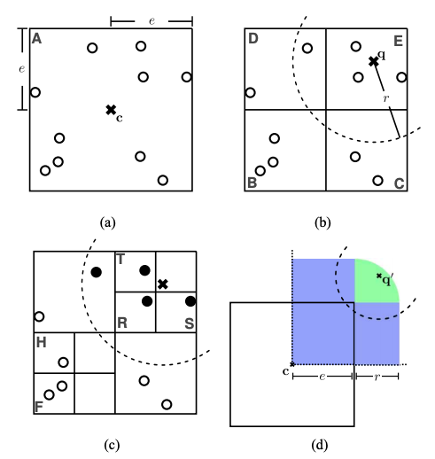
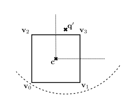
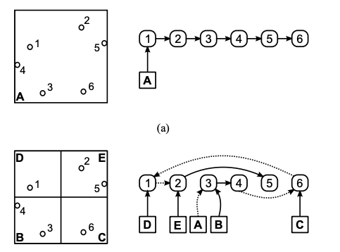

# Efficient Radius Neighbor Search in Three-dimensional Point Clouds

## Abstract

Finding all neighbors of a point inside a given
radius is an integral part in many approaches using threedimensional laser range data. We present novel insights to significantly improve the runtime performance of radius neighbor search using octrees.  
Our contributions are as follows: We
propose an index-based organization of the point cloud such
that we can efficiently store start and end indexes of points
inside every octant and exploiting this representation, we can
use pruning of irrelevant subtrees in the traversal to facilitate
highly efficient radius neighbor search. We show significant
runtime improvements of our proposed octree representation
over state-of-the-art neighbor search implementations on three
different urban datasets.


## Links

* [Efficient Radius Neighbor Search in Three-dimensional Point Clouds](http://jbehley.github.io/papers/behley2015icra.pdf) using **Octrees** by Jens Behley, Volker Steinhage, and Armin B. Cremers
* [GitHub: jbehley/octree](https://github.com/jbehley/octree)


## Idea

* sparing representation of points inside each octant
* prune subtrees of the octree if an octant is completely inside the query region

## Recapitulation

### Naive approach for radius neighbor search in octrees

Retriving all neighbors for an arbitrary query point $\vec{q} \in R^3$ and radius $r \in R$ with respect to a norm $||\cdot||$:

* traversing the octree recursively (starting at the root) and investigate octants overlapping the search ball $S(\vec{q}, r)$
* reaching an overlapping leaf octant:
	* check all points $\vec{p}$ inside the octant, i.e. $||\vec{p} - \vec{q}||<r$

thus, only comparing points inside overlapping leaf octants

 	


## (Possible) Improvements

* **Input:** Octant O, query point q, radius r, result set R
* **Result:** R contains all radius neighbors N (q, r)

```cpp
if O is inside S(q, r) then
	Add all points inside O to R
	return
end
if O is leaf octant then
	foreach point p inside O do
		Add p to R if ||p − q|| < r holds
	end
	return
end
foreach child octant C of O do
	if S(q, r) overlaps C: radiusNeighbors(C, q, r, R)
end
```

### Inclusion check

If a octant is (completely) inside a serch ball $S(\vec{q}, r)$, each point inside the octant must be also inside $S(\vec{q}, r)$. Consequently, the traversal of the octree in a subtree can stop as soon as a octant that is completely inside of $S(\vec{q}, r)$ and simply all points inside can be added.




### Index-based octree

**Or: How to efficiently store the points and link every octant with the contained points (with minimal overhead in the representation of an octant).**

As long as points inside an octant together are kept together, reordering the
subsets arbitrarily in every level of the octree is possible. This insight
is the key to a representation, enables to link each
octant with the points inside it.

* subdivide the points into subsets (starting at the root)
* reorder them suchtthat the points of each child octant are sequenced together
	* use an array of succesors
	* such that $succ(i) = n$ maps to the next point $\vec{p}_n$ that is inside an octant or the first point of the next child octant
	* successor relation represents a single-connected list



#### Pseudocode

* **Input:** octant center cO, extent eO, start index sO, end index tO, number of points MO
* **Result:** Octant O

```cpp
# Initialize octant O with cO, eO, sO, tO, and MO.
# Let sk be the start index, tk the end index, and Mk the
# number of points of the k-th child.
# Let ck be the child center and ek = 0.5 * eO its extent.
 if MO > b then
 	Set i = sO and j = 0
 	while j < MO do
		Determine Morton code k of pi
		if Mk = 0: sk = i
 		if Mk > 0: succ(tk) = i
 		Update tk = i and Mk = Mk + 1
 		Get next point index i = succ(i) and j = j + 1
 	end
 	Let l be the Morton code of the last child octant.
 	foreach k, where Mk > 0 do
 		Ck = createOctant(ck, ek, sk, tk, Mk)
 		Update sk and tk with new start/end of Ck
 		if Ck is first child then
 			Update octant’s start sO = sk
 		else
 			Update last child’s end succ(tl) = sk
 		end
 		Update octant’s end tO = tk and set l = k
 	end
 end
 return O
``` 

$\rightarrow \frac{1}{2}$


