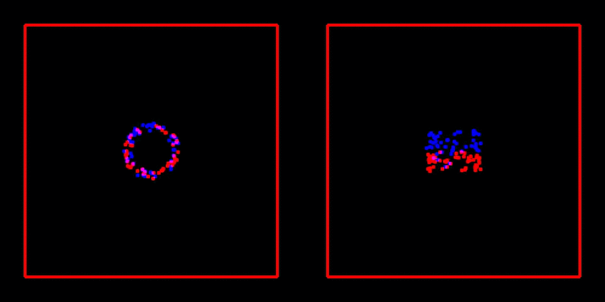

# Dynamical Load Balancing

This subdirectory implements the **parallel Barnes-Hut method/algorithm** from 

> M. Griebel, S. Knapek, and G. Zumbusch. **Numerical Simulation in Molecular Dynamics**: Numerics, Algorithms, Parallelization, Applications. 1st. Springer Pub- lishing Company, Incorporated, 2010. isbn: 3642087760

described in the sections:

* 8 Tree Algorithms for Long-Range Potentials 
	* 8.1 Series Expansion of the Potential 
	* 8.2 Tree Structures for the Decomposition of the Far Field 
	* 8.3 Particle-Cluster Interactions and the Barnes-Hut Method 
		* 8.3.1 Method 
		* 8.3.2 Implementation
		* 8.3.3 Applications from Astrophysics
	* 8.4 **ParallelTreeMethods**
		* 8.4.1 An Implementation with Keys 
		* 8.4.2 **Dynamical Load Balancing** 
		* 8.4.3 Data Distribution with Space-Filling Curves

as an extension/**parallel version of [BarnesHutSerial](../BarnesHutSerial/)**
	
## Usage

* **Compilation** via `make`
* **Running** via `mpirun -np <number of processes> ./bin/runner`
* **Cleaning** via
	* `make clean`
	* `make cleaner`
	
## Result

