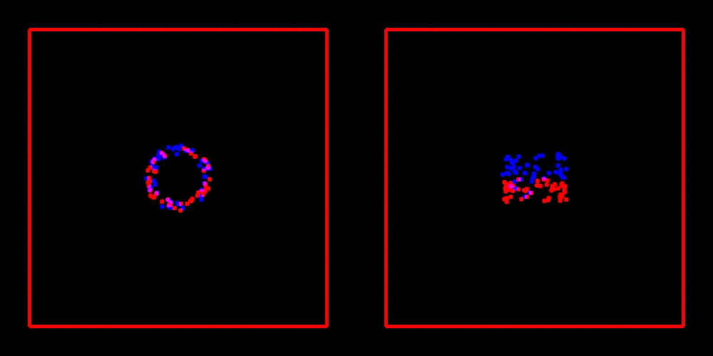

# Barnes-Hut parallel

This subdirectory implements the **parallel Barnes-Hut method/algorithm** from 

> M. Griebel, S. Knapek, and G. Zumbusch. **Numerical Simulation in Molecular Dynamics**: Numerics, Algorithms, Parallelization, Applications. 1st. Springer Pub- lishing Company, Incorporated, 2010. isbn: 3642087760

described in the sections:

* 8 Tree Algorithms for Long-Range Potentials 
	* 8.1 Series Expansion of the Potential 
	* 8.2 Tree Structures for the Decomposition of the Far Field 
	* 8.3 Particle-Cluster Interactions and the Barnes-Hut Method 
		* 8.3.1 Method 
		* 8.3.2 Implementation
		* 8.3.3 Applications from Astrophysics
	* 8.4 **Parallel Tree Methods**
		* 8.4.1 **An Implementation with Keys** 
		* 8.4.2 **Dynamical Load Balancing** 
		* 8.4.3 **Data Distribution with Space-Filling Curves**

as an extension/**parallel version of [BarnesHutSerial](../BarnesHutSerial/)**
	
There are **3 parallel implementations** which build on each other and represent additions or rather improvements to the previous version:

* **[Basic](Basic/)** 
	* corresponding to **Parallel Tree Methods - An Implementation with Keys**
* **[DynamicalLoadBalancing](DynamicalLoadBalancing/)** 
	* corresponding to **Parallel Tree Methods - Dynamical Load Balancing**
* **[SpaceFillingCurves](SpaceFillingCurves/)** 
	* corresponding to **Parallel Tree Methods - Data Distribution with Space Filling Curves**
* **[OOP](OOP/)**
	* object orientated version of the three above in one program 

## Comparison of Lebuesgue and Hilbert space-filling curves

> N=100, m=1.1e-4, v=0.05, delta\_t=1.0, t\_end=300

Parallelized on two processes:

* Particles on process 0: *blue* dots 
* Particles on process 1: *red* dots

### Lebesgue space-filling curve


### Hilbert space-filling curve


## Parallel HDF5 support

The C++ header only library [HighFive](https://github.com/BlueBrain/HighFive) is used for all HDF5 file-I/O operations.

To write particle data to HDF5 file without collecting all particles on *one* process, we utilize [parralell HDF5](https://support.hdfgroup.org/HDF5/PHDF5/) which is not supported by many standard distributions of HDF5. Therefore we build it from [source](https://www.hdfgroup.org/downloads/hdf5/source-code/).

### Installation on MacOS

Building HDF5 from source code supporting parallel file-I/O via MPI should work as described [here](https://gist.github.com/kentwait/280aa20e9d8f2c8737b2bec4a49b7c92).

If problems are encountered building:

* Update your toolchain with ```brew upgrade```
* Resolve possible conflicts between **macports** and **homebrew** as described [in this issue](https://github.com/pyenv/pyenv/issues/1267#issue-comment-box)
* Failing test concerning [oversubscribing](https://www.open-mpi.org/faq/?category=running#oversubscribing) issued by ```make check``` can be ignored 

### Installation on Ubuntu

> TODO


