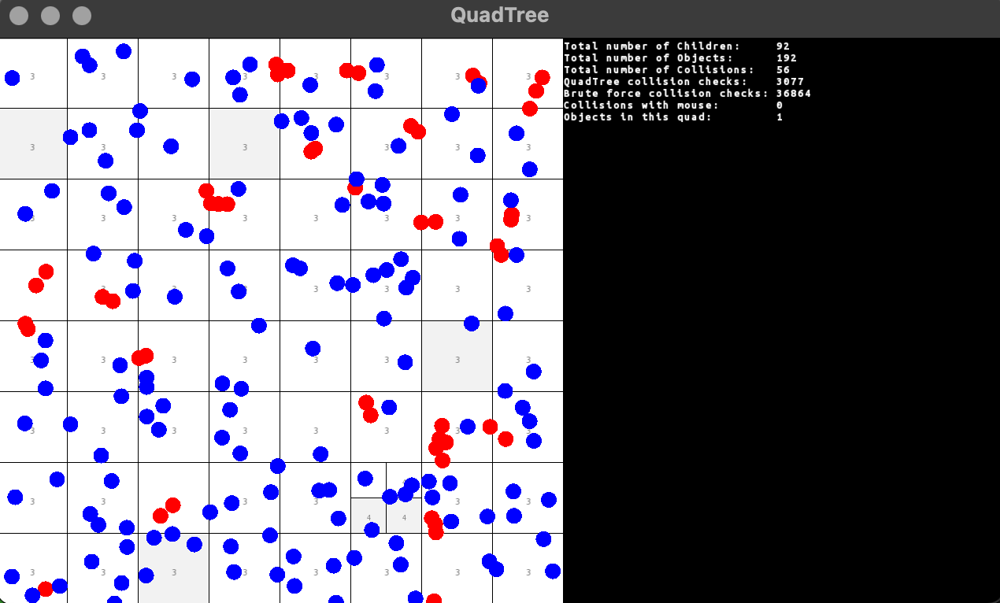

# Nearest neighbor search (NNS)

**Find more detailed descriptions within the subdirectories!**

This repository investigates different implementations of the [Nearest neighbor search (NNS)](https://en.wikipedia.org/wiki/Nearest_neighbor_search) problem or rather the [fixed-radius near neighbor problem](https://en.wikipedia.org/wiki/Fixed-radius_near_neighbors#:~:text=In%20computational%20geometry%2C%20the%20fixed,and%20a%20fixed%20distance%20%CE%94.) as variant of NNS problem for the application of smoothed particle hydrodynamics (SPH).

## Examples 

### 3D

Centered star and > 30000 particles in a disk.

Centered binary star and > 30000 particles in a disk.

### 2D

#### CollisionFreeQuadTree

#### CollisionQuadTree

#### NBodyQuadTree

